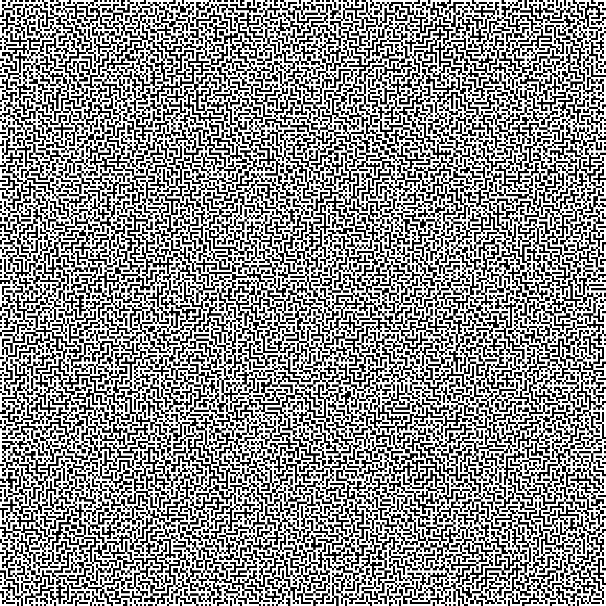

# HackCon2018: Programming 100 - aMAZEing

## Problem Statement

We intercepted some weird transmission. Can you find what they are hiding?!

`nc 139.59.30.165 9300`

Here is the prompt:

```
Get ready to solve some mazes.
We will send you a image over this socket. Give us the path which is required to go from position (0,0) in the top left to position (n, n) in the bottom right.
If no such path is possible please send back 'INVALID' without any quotes.

The path should be given in terms of WASD alphabets. Where they represent the folling:
         W = Move up
         A = Move left
         S = Move down
         D = Move right

Ready to recieve (Press Enter)

...

WooHoo you got it correct. Now solve a few more and get your flag.
```

### Sample Image



## Solution

### Explanation

The task asks you to download images of mazes and find paths from the top left corner to the bottom right corner. This is just your standard path finding. In my case, I used __Breadth-First-Search (BFS)__.

So first we have to get the image. I'm used to loading imagine from a file so I opted to save the image first. If you read the source code, you might notice that the

```python
from pwn import *

def fetch_image(r):
	image_delimiter = 'INVALID\n'
    image = r.recvuntil(image_delimiter)

	while image[1] != 'P':
		image = image[1:]

	with open('100.png', 'wb') as f:
		f.write(image)

r = remote('139.59.30.165', 9300)

```

And from here you just load the image and create a map of passable and impassable cells

```python
from scipy import misc
...

def solve():
	maze = misc.imread('100.png')

	width, height, _ = maze.shape

	cell_width = 10
	width /= cell_width
	height /= cell_width
	bitmap = [[1 if (maze[x*cell_width][y*cell_width][0] == 0) else 0 for x in range(width)] for y in range(height)]
    ...
```

This is now your standard BFS. Now note that in the challenge, there are special cases of when the starting and/or ending cells are walls/impassable, and it is still considered a valid maze.

```python
from Queue import Queue
...

dx = [0, 1, 0, -1]
dy = [1, 0, -1, 0]
cmd = ['S', 'D', 'W', 'A']

...

def solve():
    ...
	bitmap = ...

	flag = {}
	prev_move = {}
	prev_move[(0,0)] = -1

	q = Queue()
	q.put((0, 0))

	while(not q.empty()):
		x, y = q.get()
		for d in range(4):
			_x = x + dx[d]
			_y = y + dy[d]
			if min(_x, _y) < 0 or _x >= width or _y >= height:
				continue
			if _x == width-1 and _y == height-1:
				flag[(_x, _y)] = d
			if bitmap[_x][_y]:
				continue
			if (_x, _y) in flag:
				continue
			flag[(_x, _y)] = d
			q.put((_x, _y))

	ans = []
	x = width-1
	y = height-1
	if (x,y) not in flag:
		return 'INVALID'
	else:
		while(max(x, y) > 0):
			d = flag[(x,y)]
			ans.append(cmd[d])
			x -= dx[d]
			y -= dy[d]
		ans.reverse()
		return ''.join(ans)
```

After sending the directions you would get a confirmation and get another image.
```
WooHoo you got it correct. Now solve a few more and get your flag.
```

__And that would still be the message even if it will send the flag and not an image.__

### Full Code

```python
from Queue import Queue
from pwn import *
from scipy import misc

dx = [0, 1, 0, -1]
dy = [1, 0, -1, 0]
cmd = ['S', 'D', 'W', 'A']

def fetch_image(r):
	image_delimiter = 'INVALID\n'
	image = ''
	try:
		# image = r.recvuntil(image_delimiter)
		while image_delimiter not in image:
			image += r.recv()
	except:
		print(image)
		return

	while image[1] != 'P':
		image = image[1:]

	with open('100.png', 'wb') as f:
		f.write(image)

def solve():
	maze = misc.imread('100.png')

	width, height, _ = maze.shape

	cell_width = 10
	width /= cell_width
	height /= cell_width
	bitmap = [[1 if (maze[x*cell_width][y*cell_width][0] == 0) else 0 for x in range(width)] for y in range(height)]

	flag = {}
	prev_move = {}
	prev_move[(0,0)] = -1

	q = Queue()
	q.put((0, 0))

	while(not q.empty()):
		x, y = q.get()
		for d in range(4):
			_x = x + dx[d]
			_y = y + dy[d]
			if min(_x, _y) < 0 or _x >= width or _y >= height:
				continue
			if _x == width-1 and _y == height-1:
				flag[(_x, _y)] = d
			if bitmap[_x][_y]:
				continue
			if (_x, _y) in flag:
				continue
			flag[(_x, _y)] = d
			q.put((_x, _y))

	ans = []
	x = width-1
	y = height-1
	if (x,y) not in flag:
		return 'INVALID'
	else:
		while(max(x, y) > 0):
			d = flag[(x,y)]
			ans.append(cmd[d])
			x -= dx[d]
			y -= dy[d]
		ans.reverse()
		return ''.join(ans)


r = remote('139.59.30.165', 9300)
r.recvuntil('Enter)\n')
r.send('\n')

while True:
	fetch_image(r)
	r.send('{}\n'.format(solve()))
	res = r.recvline()

r.close()
```

### Output
```
Congratulations the flag is d4rk{1_h0p3_y0u_tr1ed_paint_lm40}c0de
```
