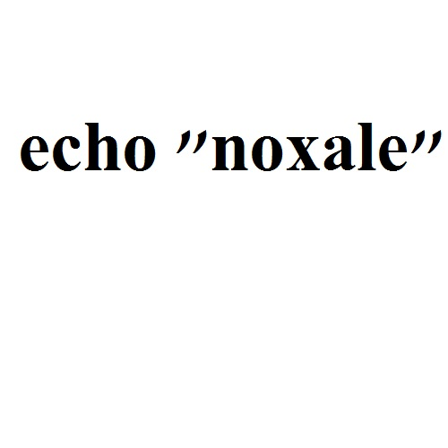

# noxCTF 2018: HashTag

__Tags:__ `misc`
__Total Solvers:__ 11    
__Total Points:__ 902

## Problem Statement

my_flag_lost - Can you help me break the hash and get my flag?

http://chal.noxale.com:3871

https://drive.google.com/open?id=1n7ZIRv9UmBHD4rAL1q_O1zfU2R1nwcR6



### Server

See `server.py` for full implementation of server.
```python
# -*- coding: utf-8 -*-
from flask import Flask, render_template, request
import os
from PIL import Image
from pytesseract import image_to_string
import binascii


...

@app.route('/uploader', methods=['GET', 'POST'])
def upload():
    if request.method == 'POST':
        f = request.files['file']
        f.save(f.filename)

        file_hash = hashtag(f.filename)
        print file_hash
        if file_hash == "75f2f2b893d1e9fb76163d279ac465f3b3eaf31f0c5abd91648717f43ec6":
            try:
                data_of_file = image_to_string(Image.open(f.filename)).encode('ascii', 'ignore').decode('ascii')
                print data_of_file
            except Exception as e:
                os.remove(f.filename)
                return str(e)
            can_run = False
            if " " not in data_of_file:
                if data_of_file == "ls":
                    can_run = True
            else:
                command = data_of_file.split(" ")
                if len(command) < 3 and (command[0] == "cat" or command[0] == "ls" or command[0] == "echo"): 		
                    can_run = True

            if can_run:
                try:
                result = os.popen(data_of_file).read()
                except Exception as e:
                        os.remove(f.filename)
                    return str(e)
            else:
	        result = "Your command is: " + data_of_file + " Command not found, please try another command."

            if result == "":
                result = "Wrong command! Command '" + data_of_file + "'"
        else:
            result = "The hash of the file must be - 75f2f2b893d1e9fb76163d279ac465f3b3eaf31f0c5abd91648717f43ec6"
        os.remove(f.filename)

        return result


if __name__ == '__main__':
    app.run(host='0.0.0.0', port=3871)
```

## Solution

We  see that this is about getting a hash collision of the image that we are sending. Otherwise, any image we are sending will be ignored.

```python
file_hash = hashtag(f.filename)
print file_hash
if file_hash == "75f2f2b893d1e9fb76163d279ac465f3b3eaf31f0c5abd91648717f43ec6":
    ...
else:
    result = "The hash of the file must be - 75f2f2b893d1e9fb76163d279ac465f3b3eaf31f0c5abd91648717f43ec6"
os.remove(f.filename)
```

### Hash Collision

They are using a custom hash function.

```python
def hashtag(file):
    data = read_hex(file)
    BLOCKS = [0xd76aa478, 0xe8c7b756, 0x242070db, 0xc1bdceee, 0xf57c0faf, 0x4787c62a, 0xa8304613, 0xfd469501, 0x698098d8,
        0x8b44f7af, 0xffff5bb1, 0x895cd7be, 0x6b901122, 0xfd987193, 0xa679438e, 0x49b40821, 0xf61e2562, 0xc040b340, 0x265e5a51,
        0xe9b6c7aa, 0xd62f105d, 0x02441453, 0xd8a1e681, 0xe7d3fbc8, 0x21e1cde6, 0xc33707d6, 0xf4d50d87, 0x455a14ed, 0xa9e3e905,
        0xfcefa3f8, 0x676f02d9	, 0x8d2a4c8a, 0xfffa3942, 0x8771f681, 0x6d9d6122, 0xfde5380c, 0xa4beea44, 0x4bdecfa9, 0xf6bb4b60,
        0xbebfbc70, 0x289b7ec6, 0xeaa127fa, 0xd4ef3085, 0x04881d05, 0xd9d4d039, 0xe6db99e5, 0x1fa27cf8, 0xc4ac5665, 0xf4292244,
        0x432aff97, 0xab9423a7, 0xfc93a039, 0x655b59c3, 0x8f0ccc92, 0xffeff47d, 0x85845dd1, 0x6fa87e4f, 0xfe2ce6e0, 0xa3014314,
        0x4e0811a1, 0xf7537e82, 0xbd3af235, 0x2ad7d2bb, 0xeb86d391, 0xd76aa478, 0xe8c7b756, 0x242070db, 0xc1bdceee, 0xf57c0faf,
        0x4787c62a, 0xa8304613, 0xfd469501, 0x698098d8, 0x8b44f7af, 0xffff5bb1, 0x895cd7be, 0x6b901122, 0xfd987193, 0xa679438e,
        0x49b40821, 0xf61e2562, 0xc040b340, 0x265e5a51, 0xe9b6c7aa, 0xd62f105d, 0x02441453, 0xd8a1e681, 0xe7d3fbc8, 0x21e1cde6,
        0xc33707d6, 0xf4d50d87, 0x455a14ed, 0xa9e3e905, 0xfcefa3f8, 0x676f02d9	, 0x8d2a4c8a, 0xfffa3942, 0x8771f681, 0x6d9d6122,
        0xfde5380c, 0xa4beea44, 0x4bdecfa9, 0xf6bb4b60, 0xbebfbc70, 0x289b7ec6, 0xeaa127fa, 0xd4ef3085, 0x04881d05, 0xd9d4d039,
        0xe6db99e5, 0x1fa27cf8, 0xc4ac5665, 0xf4292244, 0x432aff97, 0xab9423a7, 0xfc93a039, 0x655b59c3, 0x8f0ccc92, 0xffeff47d,
        0x85845dd1, 0x6fa87e4f, 0xfe2ce6e0, 0xa3014314, 0x4e0811a1, 0xf7537e82, 0xbd3af235, 0x2ad7d2bb, 0xeb86d391]

    divider = int(len(data) / 64)
    list_from_file = []
    temp_file = ""
    for i in range(len(data)):
        if (i + 1) % divider == 0:
            temp_file += data[i] + " "
        else:
            temp_file += data[i]
    if temp_file[-1] == " ":
        temp_file = temp_file[:-1]
    list_from_file = temp_file.split(" ")

    f = ""
    for i in range(len(list_from_file)):
        f += hex(int(list_from_file[i], 16) ^ BLOCKS[i])[2:-1]

    temp_file = ""
    list_from_file = []
    for i in range(len(f)):
        if (i + 1) % 60 == 0:
            temp_file += f[i] + " "
        else:
            temp_file += f[i]

    if temp_file[-1] == " ":
        temp_file = temp_file[:-1]

    list_from_file = temp_file.split(" ")
    f = int(list_from_file[0], 16)
    for i in range(len(list_from_file)):
        if i != 0:
            f = f ^ int(list_from_file[i], 16)
    return hex(f)[2:-1]
```

This hash function can be summarized in these steps:
1. Divide the entire file into 64 chunks.
2. XOR each chunk with some arbitrary number
3. Combine these chunks back
4. Divide this to chunks of 60 hex characters.
5. XOR these chunks to get the hashtag

Since all operations are just bitwise `XOR`, then this makes things much simpler. Since there is no permutation or substitution techniques used in cryptographically secure hashes.

For sufficiently large input, we can practically ignore the first few steps. Although they do affect the hash, our manipulations will not rely on them.

Our simplified view of the hashing function is:
1. Divide this to chunks of 60 hex characters.
2. XOR these chunks to get the hashtag

This means that we can flip the last few bits of the file and it will flip its corresponding bit on the hashes.

```
file ^ 1 == hash(file) ^ 1
```

At this point, this is just simple bit algebra.

```
desired = 75f2f2b893d1e9fb76163d279ac465f3b3eaf31f0c5abd91648717f43ec6
file_hash = hash(file)
diff = file_hash^desired
new_file = file^diff
desired == hash(new_file)
```

One problem to note is that the last chunk when the file is divided is less than 60 characters. So we will not be able to fully manipulate the hash. So we manipulate the penultimate chunk

```
XXXXXXXXXXXXXXXXXXXXXXXXXXXXXXXXXXXXXXXXXXXXXXXXXXXXXXXXXXXX
XXXXXXXXXXXXXXXXXXXXXXXXXXXXXXXXXXXXXXXXXXXXXXXXXXXXXXXXXXXX
XXXXXXXXXXXXXXXXXXXXXXXXXXXXXXXXXXXXXXXXXXXXXXXXXXXXXXXXXXXX
XXXXXXXXXXXXXXXXXXXXXXXXXXXXXXXXXXXXXXXXXXXXXXXXXXXXXXXXXXXX    <-- We manipulate this.
XXXXXXXXXXXXXXXXXXXXXXXXXXXXXXX
```

We do this by offsetting the fix

```python
while hash(file_data ^ fix) != desired:
      fix = fix<<4
```

### Fixing the hash of an image

So that we do not corrupt the image, we first append bytes before we do our file fix.

```python
old_file_data = read_hex(file) + 'f'*120
```

With this and commands `ls` and `cat`, we get the flag


`noxCTF{#BR0K3N_H4SH}`

## Implementation
```python
import binascii
from server import read_hex, hashtag

def write_file(file_name, data):
    with open(file_name, 'wb') as f:
        f.write(binascii.unhexlify(hex(data)[2:-1]))

desired = '75f2f2b893d1e9fb76163d279ac465f3b3eaf31f0c5abd91648717f43ec6'
desired_value = int(desired, 16)

def fix_hex(file):
    old_file_data = read_hex(file) + 'f'*120
    new_file_name = 'fixed_{}'.format(file)
    write_file(new_file_name, int(old_file_data, 16))

    curr_hash = int(hashtag(new_file_name), 16)
    fix = desired_value ^ curr_hash
    while hashtag(new_file_name) != desired:
        file_data = int(old_file_data, 16) ^ fix
        write_file(new_file_name, file_data)
        fix = fix<<4    

    # write_file('fixed_{}'.format(file), file_data)

fix_hex('ls.jpg')
fix_hex('flag.jpg')
```
