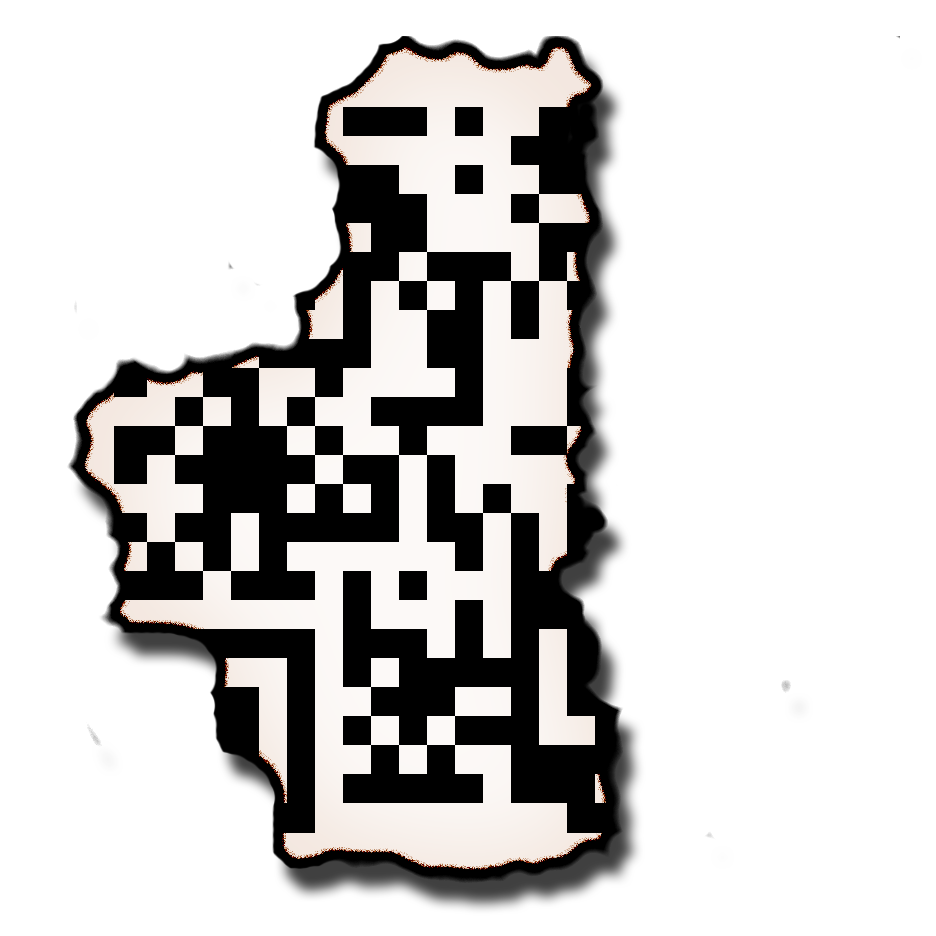
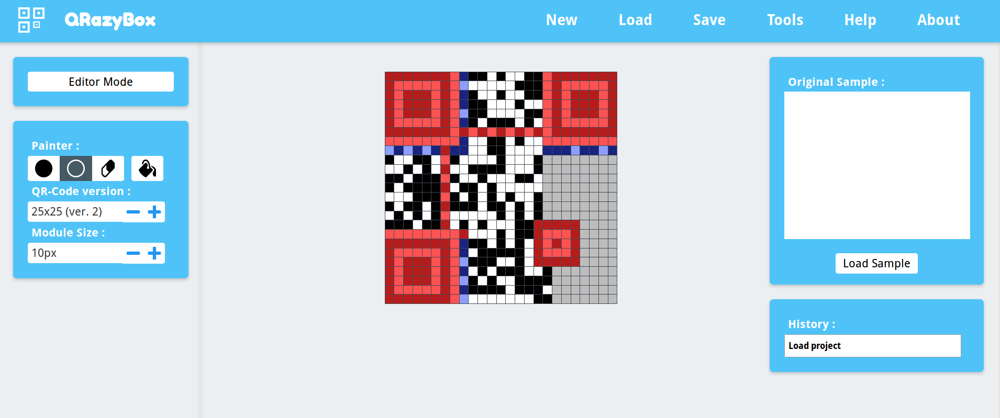
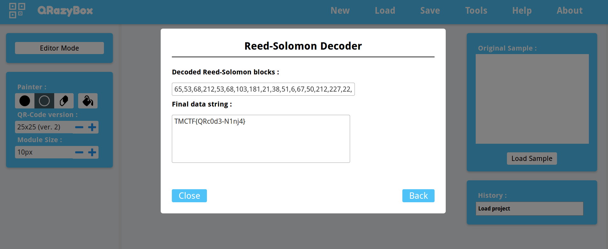

# Trendmicro 2018: Forensics Crypto 100

__Tags:__ `misc`
__Total Points:__ 100

## Problem Statement

Here is the full flag, unfortunately it burnt a bit. I know you can handle it with all the things you know.

## Solution

The solution is the use the QR Code Error Correction capabilities. Most of the brunt out regions position and alignment sections.

We use [merricx's qrazybox](https://merricx.github.io/qrazybox/) to recreate the QR code manually.

And then use the Reed-Solomon error correction to retrieve the flag.

