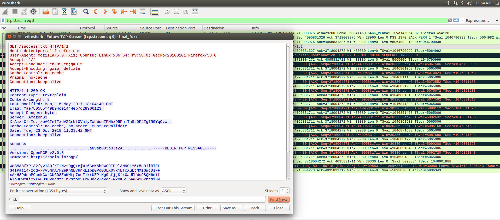
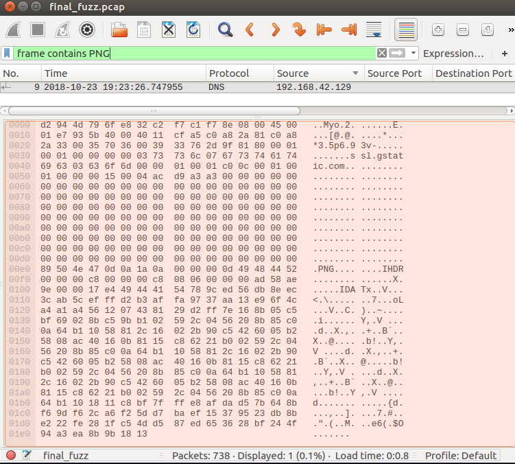

# BSides Dehli CTF 2018: FuzzY (Forenics 200)

__Tags:__ `forensics`, `network`  
__Total Points:__ 200

## Problem Statement

Bob and Charlie were sending some messages among themselves,and I planned to intercept their messages and get something out of it, however, they are clever enough that no secret gets leaked. Please help me out to get the secret!!

__Note:__ You are given `final_fuzz.pcap`

## Solution

Analysis of the pcap shows that there is a __PGP message__ and __PNG image__ that is exfiltrated through DNS. We extract the image and contains the __PGP key__.


### Finding the PGP Message

A quick `strings` command shows us the PGP message.

```bash
$ strings final_fuzz.pcap -n27
...
Date: Tue, 23 Oct 2018 11:23:42 GMT
-----BEGIN PGP MESSAGE-----
Comment: https://sela.io/pgp/
wcBMA8fXP+32fyviAQf/T+NzsOgQ+ejW16GeK6h9WS9IDelAN9GLY5x5o9ilBlEL
...
```

It's pretty easy to see it in the pcap file it's pretty small. Look for `frame contains PGP` and follow the TCP stream.


This gives us the encrypted message. Also note we see a encoded message `aGVsbG93b3JsZA==` which decodes to `helloworld`, this is possibly the password.

 We still need to look for the key.

### Finding the PNG file

One of my teammates used `binwalk` and noted that a png file was identified inside the PCAP.

We queried for `frame contains PNG`



### Extracting the PNG

__The PNG is embedded in the padding of the DNS requests.__

We filter DNS packets coming from `192.168.42.129` that contain some padding. We write a short `scapy` script to extract the image.

```python
from scapy.all import *

pcap = rdpcap('final_fuzz.pcap')

with open('out.png', 'wb') as f:
	for e in pcap:
		if IP not in e:
			continue
		if e[IP].src != '192.168.42.129':
			continue
		if DNS not in e:
			continue
		dns = e[DNS]
		if Padding not in e:
			continue
		f.write(str(dns[Padding]).lstrip(chr(0)))
```

This gives us a QR Code.


Decoding the QR Code gives us the private key. And with that we get the flag `flag{eNcryP7!ng_t0_PgP_1s_r34LLy_Pre3tY_g00D_pr1V4cY}`
