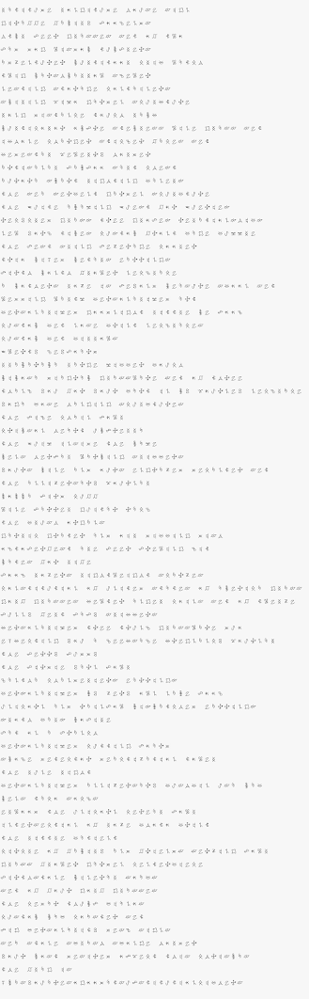
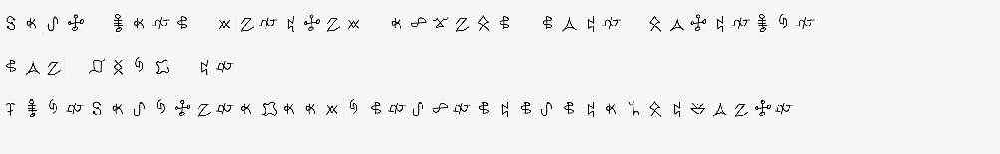

# X-MAS CTF 2018: Special Christmas List (Crypto 50)

__Tags:__ `substitution`  
__Total Points:__ 50  
__Toal Solvers:__ 124

## Problem Statement

> While Santa was looking through the wishlists of the childern all around the world he came across a very strange looking one. Help Santa decode the letter in order to fulfill the wishes of this child.

## Solution

For this I did this manually, and guess that the last 2 lines were `THE FLAG IS _____`

And tried to decode the other words from the symbols I can recognize to get the flag

`xmasyouaresogoodatsubstitutionciphers`
