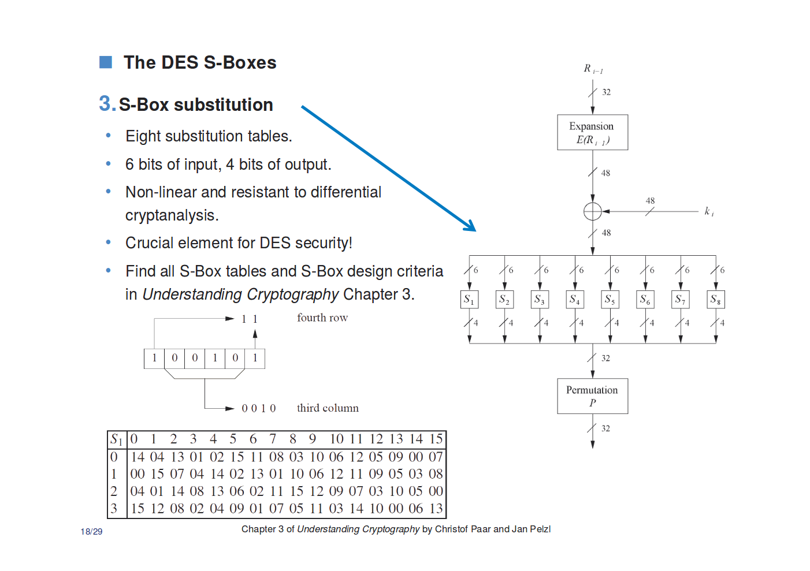

# X-MAS CTF 2018: A white rabbit in a snowstorm (Crypto 460)

__Tags:__ `des`, `xor`  
__Total Points:__ 482    
__Toal Solvers:__ 21


## Problem Statement

You are given the implementation of the encryption as well as a decryption oracle,

```
Ok, you can continue, go on!
The key will be the same for the encryption and all decryptions during this session!
Here's the encrypted flag: 0aa68eb0bd03595d!
Here's the partial decription oracle!

Provide a 8-byte string you want to decrypt as hex input:
(the string has to have at least half of the bits different from the ciphertext)
$ dddddddddddddddd
The decryption of dddddddddddddddd is eee303655851e6ad.
```

The implementation of the `des.py` is long but it can be found in `files/des.py`.

## Solution

For these kinds of problems, where the implementation is given, it is important to know what the proper implementation of the algorithm is so that when you spot differences in the implementation, then you can deduce what kind of vulnerabilities are introduced. In this case, it claims to be `des` and is probably derived a python implementation of des, [pydes](https://github.com/RobinDavid/pydes/blob/master/pydes.py)

I will reference some slides from the slides of Chapter 3 of [Understanding Cryptography
by Christof Paar and Jan Pelzl](http://www.crypto-textbook.com/)

Here there are two main differences.

### Expansion

#### Original

```python
E = [32, 1, 2, 3, 4, 5,
     4, 5, 6, 7, 8, 9,
     8, 9, 10, 11, 12, 13,
     12, 13, 14, 15, 16, 17,
     16, 17, 18, 19, 20, 21,
     20, 21, 22, 23, 24, 25,
     24, 25, 26, 27, 28, 29,
     28, 29, 30, 31, 32, 1]
```

#### Modified

```python
E = [3, 1, 2, 3, 4, 2,
     7, 5, 6, 7, 8, 6,
     11, 9, 10, 11, 12, 10,
     15, 13, 14, 15, 16, 14,
     19, 17, 18, 19, 20, 18,
     23, 21, 22, 23, 24, 22,
     27, 25, 26, 27, 28, 26,
     31, 29, 30, 31, 32, 30]
```
#### Effects on DES


This means that changes to each bit only affects its neighborhood of 4 bits and its corresponding 4 bits in the other half. So changes are "_localized_", but this change does not really matter because of the changes discussed next.

### S-Boxes

#### Original
```python
S_BOX = [

[[14, 4, 13, 1, 2, 15, 11, 8, 3, 10, 6, 12, 5, 9, 0, 7],
 [0, 15, 7, 4, 14, 2, 13, 1, 10, 6, 12, 11, 9, 5, 3, 8],
 [4, 1, 14, 8, 13, 6, 2, 11, 15, 12, 9, 7, 3, 10, 5, 0],
 [15, 12, 8, 2, 4, 9, 1, 7, 5, 11, 3, 14, 10, 0, 6, 13],
],

[[15, 1, 8, 14, 6, 11, 3, 4, 9, 7, 2, 13, 12, 0, 5, 10],
 [3, 13, 4, 7, 15, 2, 8, 14, 12, 0, 1, 10, 6, 9, 11, 5],
 [0, 14, 7, 11, 10, 4, 13, 1, 5, 8, 12, 6, 9, 3, 2, 15],
 [13, 8, 10, 1, 3, 15, 4, 2, 11, 6, 7, 12, 0, 5, 14, 9],
]
...
```

#### Modified
```python
S_BOX=[
[[0, 1, 2, 3, 4, 5, 6, 7, 8, 9, 10, 11, 12, 13, 14, 15],
 [0, 1, 2, 3, 4, 5, 6, 7, 8, 9, 10, 11, 12, 13, 14, 15],
 [0, 1, 2, 3, 4, 5, 6, 7, 8, 9, 10, 11, 12, 13, 14, 15],
 [0, 1, 2, 3, 4, 5, 6, 7, 8, 9, 10, 11, 12, 13, 14, 15]],

[[0, 1, 2, 3, 4, 5, 6, 7, 8, 9, 10, 11, 12, 13, 14, 15],
 [0, 1, 2, 3, 4, 5, 6, 7, 8, 9, 10, 11, 12, 13, 14, 15],
 [0, 1, 2, 3, 4, 5, 6, 7, 8, 9, 10, 11, 12, 13, 14, 15],
 [0, 1, 2, 3, 4, 5, 6, 7, 8, 9, 10, 11, 12, 13, 14, 15]],
...
```

#### Effects on DES



This change removes s-box! It is basically a passthrough function, which means that the modified DES is linear and therefore vulnerable to cryptanalysis.

### Attack

Since the modified DES is linear, then you can think of it as just a big equation of `XORs`. That means __flipping 1 bit of ciphertext, predictably flips some subset of bits for any ciphertext__.

```python
xr = decrypt(m)^decrypt(m^b)
```

Given `b`, then `xr` is constant. We just choose `b` such that it flips at least half of `m`, as required by the problem.

```python
b = chr(255)*8

test_ct = chr(0)*8
ct_1 = decrypt(test_ct)
ct_2 = decrypt(xor(test_ct, b))
xr = xor(ct_1, ct_2)

# xr = '\xaa'*8
pt_flipped_flag = decrypt(xor(ct_flag, b))

print 'X-MAS{%s}' % xor(pt_flipped_flag, xr)

```

This gives us the flag `X-MAS{Sb0xd3s!}`

### Implementation

For brevity, we will not show the code for the captcha.

```python
from pwn import *
import binascii

r = remote('199.247.6.180',  16003)

prompt = r.recvuntil('oracle!')
ct_flag = binascii.unhexlify(prompt.split('flag: ')[1].split('!')[0])

def decrypt(x):
	r.sendline(binascii.hexlify(x))
	res = r.recvuntil('.\n')
	return binascii.unhexlify(res.split('is ')[1].split('.')[0])

b = chr(255)*8
# test_ct = chr(0)*8
# ct_1 = decrypt(test_ct)
# ct_2 = decrypt(xor(test_ct, b))
# xr = xor(ct_1, ct_2)

xr = '\xaa'*8
pt_flipped_flag = decrypt(xor(ct_flag, b))

print 'X-MAS{%s}' % xor(pt_flipped_flag, xr)
```
