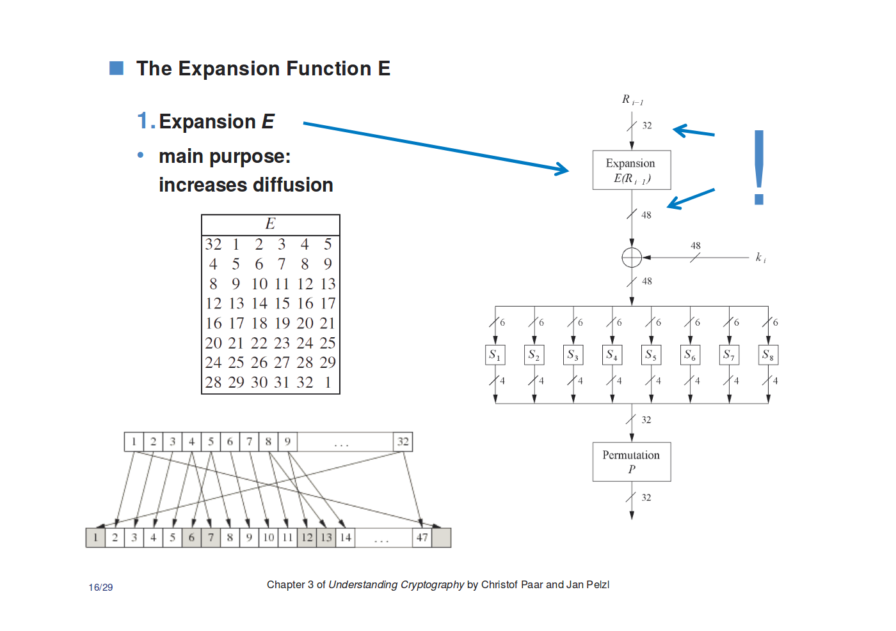
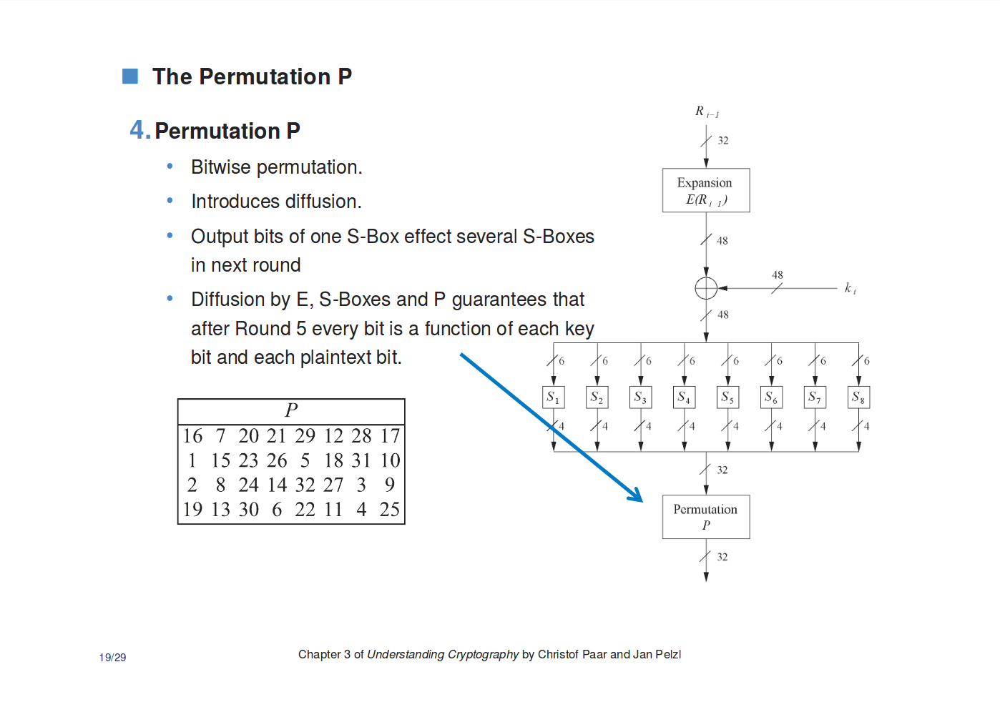

# X-MAS CTF 2018: A black rabbit in the dark (Crypto 497)

__Tags:__ `des`, `brute-force`  
__Total Points:__ 497    
__Toal Solvers:__ 10

## Problem Statement

You are given the implementation of the encryption as well as a encryption oracle,

```
Ok, you can continue, go on!
The key will be the same for all the encryptions during this session!
You can do at most 512 encryptions every session.
Here's the encrypted flag: 58dc34b5be01b198196df8bc8107f46b54fd7d61b727d14b255cff803a47632c966ea0151b88d5cee9e9169bba23dd7a1648c796b40ee3526cf23d8f214b7e39f6e805913c22986eecd81fa815220535d8f81682b214fa5fdde43c883e31232eec60e908fd4aebf7!
Here's the encryption oracle!

Provide a string you want to encrypt as hex input:
(the string has to be 8 bytes long)
$  
```

The implementation of the `des.py` is long but it can be found in `files/des.py`.

## Solution

Similar to our solution in _A White Rabbit_, for these kinds of problems, where the implementation is given, it is important to know what the proper implementation of the algorithm is so that when you spot differences in the implementation, then you can deduce what kind of vulnerabilities are introduced. In this case, it claims to be `des` and is probably derived a python implementation of des, [pydes](https://github.com/RobinDavid/pydes/blob/master/pydes.py)

I will reference some slides from the slides of Chapter 3 of [Understanding Cryptography
by Christof Paar and Jan Pelzl](http://www.crypto-textbook.com/)

Here there are two main differences.

### Expansion

#### Original

```python
E = [32, 1, 2, 3, 4, 5,
     4, 5, 6, 7, 8, 9,
     8, 9, 10, 11, 12, 13,
     12, 13, 14, 15, 16, 17,
     16, 17, 18, 19, 20, 21,
     20, 21, 22, 23, 24, 25,
     24, 25, 26, 27, 28, 29,
     28, 29, 30, 31, 32, 1]
```

#### Modified

```python
E = [3, 1, 2, 3, 4, 2,
     7, 5, 6, 7, 8, 6,
     11, 9, 10, 11, 12, 10,
     15, 13, 14, 15, 16, 14,
     19, 17, 18, 19, 20, 18,
     23, 21, 22, 23, 24, 22,
     27, 25, 26, 27, 28, 26,
     31, 29, 30, 31, 32, 30]
```
#### Effects on DES



This means that changes to each bit only affects its neighborhood of 4 bits and its corresponding 4 bits in the other half. So changes are "_localized_", but this change does not really matter because of the changes discussed next.

### No Permutation

#### Original
```python
class des():
    ...
    def run(self, key, text, action=ENCRYPT, padding=False):
        ...
        for block in text_blocks:
            block = string_to_bit_array(block)
            block = self.permut(block,PI)
            g, d = nsplit(block, 32)
            tmp = None
            for i in range(16):
                d_e = self.expand(d, E)
                if action == ENCRYPT:
                    tmp = self.xor(self.keys[i], d_e)
                else:
                    tmp = self.xor(self.keys[15-i], d_e)
                tmp = self.substitute(tmp)
                tmp = self.permut(tmp, P)
                tmp = self.xor(g, tmp)
                g = d
                d = tmp
            result += self.permut(d+g, PI_1)
    ...
```

#### Modified
```python
class des():
    ...
    def run(self, key, text, action=ENCRYPT, padding=False):
        ...
        for block in text_blocks:
            block = string_to_bit_array(block)
            block = self.permut(block,PI)
            g, d = nsplit(block, 32)
            tmp = None
            for i in range(16):
                d_e = self.expand(d, E)
                if action == ENCRYPT:
                    tmp = self.xor(self.keys[i], d_e)
                else:
                    tmp = self.xor(self.keys[15-i], d_e)
                tmp = self.substitute(tmp)
                # tmp = self.permut(tmp, P) <----- removed
                tmp = self.xor(g, tmp)
                g = d
                d = tmp
            result += self.permut(d+g, PI_1)
    ...
```

#### Effects on DES



Removing the permutation _and_ modification of the expansion practically removes almost all diffusion in the DES. Therefore, modifying a bit, would only modify 8 bits.

### Attack

First, we can ignore the first and final permutation since they can be reversed easily. Since changes are localized, we can brute force for the plaintext.

Let's say we want to brute force the first 4 bits of the 0th and 4th byte of the ciphertext.

```
encrypt(aXXXXXXXbXXXXXXX) = cXXXXXXXdXXXXXXX
```
So we just have to find values for `a` and `b` that will result to a `c` and `d` that matches the encrypted flags bytes. Since `a` and `b` are 4 bits, then we only need to brute force `16^2 = 256` combinations.

This can easily be extended to all the other bytes, and get the mapping for all groups of 4 bits simultaneously.

```python
pt = [None for _ in range(len(flag)*2)]

for a in alphabet:
	for b in alphabet
		c = a*8 + b*8
		c = binascii.unhexlify(c)

		ct = encrypt(text_p)
		ct_p = binascii.hexlify(p(ct))

		for block in range(len(flag)/8):
			desired_ct = binascii.hexlify(p(flag[block*8:(block+1)*8]))
			for i in range(8):
				if ct_p[i] == desired_ct[i] and ct_p[i + 8] == desired_ct[i + 8]:
					pt[block*16 + i] = a
					pt[block*16+ i+8] = b

out = binascii.unhexlify(''.join(pt))
print(out)
```

But in the final implementation, we have to deal with the effects of the first and final permutation.


PS: to __Gabies__, the author of the problem, for helping me clean up some parts of my solution.

This gives us the flag: `X-MAS{If_y0u_r3m0ve_th3_av4l4nch3_3ff3c7_th3n_4_bl0ckc1ph3r_1s_vuln3r4ble_t0_st4tis7ic4l_an4lys1s!!!!!!}
`

### Implementation

```python
from pwn import *
import binascii

PI_1 = [40, 8, 48, 16, 56, 24, 64, 32,
        39, 7, 47, 15, 55, 23, 63, 31,
        38, 6, 46, 14, 54, 22, 62, 30,
        37, 5, 45, 13, 53, 21, 61, 29,
        36, 4, 44, 12, 52, 20, 60, 28,
        35, 3, 43, 11, 51, 19, 59, 27,
        34, 2, 42, 10, 50, 18, 58, 26,
        33, 1, 41, 9, 49, 17, 57, 25]

PI = [58, 50, 42, 34, 26, 18, 10, 2,
      60, 52, 44, 36, 28, 20, 12, 4,
      62, 54, 46, 38, 30, 22, 14, 6,
      64, 56, 48, 40, 32, 24, 16, 8,
      57, 49, 41, 33, 25, 17, 9, 1,
      59, 51, 43, 35, 27, 19, 11, 3,
      61, 53, 45, 37, 29, 21, 13, 5,
      63, 55, 47, 39, 31, 23, 15, 7]

def permut(block, table):
    return [block[x-1] for x in table]

def p(text):
    b = string_to_bit_array(text)
    t = permut(b, PI)
    return bit_array_to_string(t)

def p_inv(text):
    b = string_to_bit_array(text)
    t = permut(b, PI_1)
    return bit_array_to_string(t)

def string_to_bit_array(text):
    array = list()
    for char in text:
        binval = binvalue(char, 8)
        array.extend([int(x) for x in list(binval)])
    return array

def bit_array_to_string(array):
    res = ''.join([chr(int(y,2)) for y in [''.join([str(x) for x in bytes]) for bytes in  nsplit(array,8)]])   
    return res

def binvalue(val, bitsize):
    binval = bin(val)[2:] if isinstance(val, int) else bin(ord(val))[2:]
    if len(binval) > bitsize:
        raise "sadadsadasdasdasdasdasdasdwwwddwdqwdwdadasdsadasdade2"
    while len(binval) < bitsize:
        binval = "0"+binval
    return binval

def nsplit(s, n):
    return [s[k:k+n] for k in xrange(0, len(s), n)]


r = remote('199.247.6.180',  16004, level='error')

res = r.recvuntil('encryption oracle!')
flag = binascii.unhexlify(res.split('flag: ')[1].split('!')[0])

def encrypt(text):
		r.sendline(binascii.hexlify(text))
		r.recvuntil('The encryption of ')
		r.recvuntil(' is ')
		return binascii.unhexlify(r.recvuntil('.')[:-1])


pt = [None for _ in range(len(flag)*2)]
alphabet = '0123456789abcdef'
for a in alphabet:
	for b in alphabet:
		print(a, b)
		c = a*8 + b*8
		c = binascii.unhexlify(c)
		text_p = p_inv(c)

		ct = encrypt(text_p)
		ct_p = binascii.hexlify(p(ct))

		for block in range(len(flag)/8):
			desired_ct = binascii.hexlify(p(flag[block*8:(block+1)*8]))
			for i in range(8):
				if ct_p[i] == desired_ct[i] and ct_p[i + 8] == desired_ct[i + 8]:
					pt[block*16 + i] = a
					pt[block*16+ i+8] = b

out = binascii.unhexlify(''.join(pt))
print(''.join([p_inv(b) for b in nsplit(out, 8)]))

```
